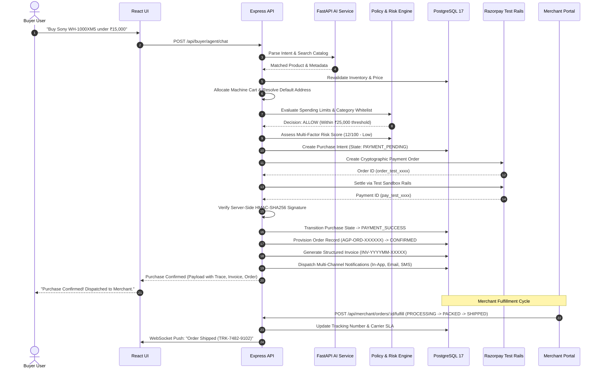

# AgentPay: The Complete System Manual & Architectural Specification

**Track 01: AI Growth & Agentic Commerce**  
*The Autonomous Financial Operating System and Commerce Infrastructure for AI Agents and Next-Generation Merchants.*

---

## 1. Executive Summary & Vision

### The Problem
Traditional e-commerce is built for human eyes—heavy graphical interfaces, dynamic JavaScript cart scripts, captchas, and manual multi-factor OTP approvals. When autonomous AI agents attempt to browse, compare, and transact on traditional storefronts, they fail due to brittle web scraping, bot protection firewalls, unannounced checkout price surges, and a lack of deterministic financial controls.

### The Solution: AgentPay
**AgentPay** is a two-sided, AI-native commerce operating system designed to enable trusted, policy-bounded autonomous purchasing between **Autonomous Buyer Agents** and **AI-Ready Merchant Catalogs**.

```
┌─────────────────────────────────────────────────────────────────────────────┐
│                               AGENTPAY PLATFORM                             │
├──────────────────────────────────────┬──────────────────────────────────────┤
│           BUYER EXPERIENCE           │         MERCHANT EXPERIENCE          │
│   • Conversational Natural-Language  │   • AI-Readable Machine Catalog      │
│     Procurement                      │   • Instant AI Product Autofill      │
│   • Deterministic Policy Guardrails  │   • 6-Pillar AI Readiness Score      │
│   • Multi-Factor Risk Assessment     │   • Real-Time Stock & Price Sync     │
│   • Human-in-the-Loop Approvals      │   • Fulfillment State Management     │
│   • Idempotent Razorpay Test Rails   │   • Demo GMV & Agentic Analytics     │
│   • Structured Tax Invoices & Order  │   • Multi-Store Integrations & OAuth │
│     Fulfillment Tracking             │                                      │
└──────────────────────────────────────┴──────────────────────────────────────┘
```

---

## 2. Core Architecture & Tech Stack

AgentPay is engineered with a modular, distributed microservices architecture prioritizing sub-second latency, deterministic governance, zero-trust security, and complete transactional auditability.

```
                           ┌───────────────────────────┐
                           │      React 18 + Vite      │
                           │  Modern Vanilla CSS / UI  │
                           └─────────────┬─────────────┘
                                         │ HTTP / REST & WebSockets
                                         ▼
                           ┌───────────────────────────┐
                           │   Express.js API Server   │ (Port 5050)
                           │   Node.js Core Backend    │
                           └──────┬─────────────┬──────┘
                                  │             │
        Internal RPC (HTTP)       │             │ Postgres Pool (pg)
        ┌─────────────────────────┘             └─────────────────────────┐
        ▼                                                                 ▼
┌─────────────────────────┐                                   ┌───────────────────────┐
│   FastAPI AI Service    │ (Port 8000)                       │   PostgreSQL 17 DB    │ (Port 5433)
│   Python 3.11 Engine    │                                   │   15 Relational Tables│
│   • NLP Catalog Parsing │                                   └───────────────────────┘
│   • Prompt Injection    │                                               ▲
│     Defense Guard       │                                               │ Cache / PubSub
│   • AI Autofill Specs   │                                   ┌───────────┴───────────┐
└─────────────────────────┘                                   │   Redis 7 (In-Memory) │ (Port 6379)
                                                              │   • Idempotency Locks │
                                                              │   • Velocity Tracking │
                                                              │   • Kill Switch State │
                                                              └───────────────────────┘
```

### Technology Matrix

| Layer | Technologies Used | Key Responsibilities |
|---|---|---|
| **Frontend** | React 18, Vite, React Router 6, Vanilla CSS Tokens | Responsive dual-experience UI (Buyer & Merchant), Live WebSocket listeners, Interactive Demo Runner, Vertical tracking timelines, Invoice viewer. |
| **Backend API** | Node.js, Express.js, Supertest, Jest | Commerce orchestration, policy engine, risk engine, order lifecycle state machine, HMAC-SHA256 signature verification, idempotency locks. |
| **AI Subsystem** | Python 3.11, FastAPI, Pydantic, Uvicorn | Natural-language query parsing, category intent mapping, prompt injection jailbreak detection, AI product autofill. |
| **Database** | PostgreSQL 17 | Append-only audit trail, relational tables (`users`, `merchants`, `products`, `orders`, `invoices`, `user_addresses`, `policies`). |
| **Cache & Bus** | Redis 7, Socket.IO | Sliding-window velocity counters, distributed idempotency mutexes, instant kill switches, real-time client event broadcasting. |
| **Payments** | Razorpay SDK (Test Mode Rails) | Cryptographic order generation, client checkout, HMAC server verification, webhook handlers. |

---

## 3. The Dual Experiences: Buyer vs. Merchant

### 3.1. The Buyer Experience (AI Shopping & Purchasing)

1. **Conversational Procurement (`/buyer/home`):**
   - Natural-language input: *"Find me the best Sony ANC headphones under ₹15,000 and deliver by tomorrow."*
   - The AI Agent discovers matching verified merchant items, revalidates stock and pricing, and presents curated recommendations.
2. **Deterministic Governance & Limits (`/buyer/preferences`):**
   - Single Transaction Limit (e.g., max ₹25,000 per purchase without approval).
   - Daily & Monthly Cumulative Spending Budgets.
   - Allowed / Blocked Product Categories.
   - Merchant Verification Enforcement (requires verified badge $\ge 4.5\bigstar$).
3. **Human-in-the-Loop Approval Center (`/buyer/approval-center`):**
   - Whenever an autonomous purchase exceeds limits or encounters elevated risk, execution pauses safely into `APPROVAL_REQUIRED`.
   - Real-time mobile/desktop alerts allow the buyer to inspect the AI reasoning and approve or reject with 1 click.
4. **Purchase Ledger & Fulfillment Tracking (`/buyer/purchases`):**
   - Searchable, filterable ledger of all transactions.
   - Real-time vertical tracking timeline: `Order Confirmed` $\to$ `Processing` $\to$ `Packed` $\to$ `Shipped (Carrier SLA)` $\to$ `Out for Delivery` $\to$ `Delivered`.
   - 1-Click **"View Official Invoice"** modal with printable PDF capabilities.
5. **Payment Connections & Mandates (`/buyer/connections`):**
   - Active payment rails management (Razorpay AutoPay, UPI Mandates, Cards).
   - Instant token revocation.

---

### 3.2. The Merchant Experience (AI Commerce Infrastructure)

1. **AI-Readable Catalog Management (`/merchant/products`):**
   - Instant conversion of standard products into machine-optimized specs.
   - **AI Autofill Feature:** Type a short product phrase (e.g., *"Ergonomic standing desk with dual motors"*), and the AI automatically generates title, category, machine keywords, technical specs, and target audience metadata.
2. **AI Readiness Engine (`/merchant/ai-commerce`):**
   - Real-time auditing of catalog quality across **6 Fundamental Pillars**:
     1. **Autonomous Discovery API:** Machine-parseable JSON endpoints.
     2. **Live Stock & Inventory Sync:** Webhook synchronization preventing out-of-stock checkouts.
     3. **AI Metadata & Machine Descriptions:** Rich semantic categorization for agent matching.
     4. **Normalized Machine Specifications:** Structured JSON-LD / attribute tables.
     5. **Price Stability & Freeze Guarantees:** Zero unannounced checkout price jumps.
     6. **Instant Payment Rails:** Automated Razorpay test rails settlement.
3. **AI-Originated Order & Fulfillment Management (`/merchant/orders`):**
   - Live stream of orders placed autonomously by AI buyer agents.
   - Server-validated fulfillment advance controls:
     - `[Mark as Processing]` $\to$ `[Mark Packed]` $\to$ `[Ship Package with Carrier Tracking]` $\to$ `[Confirm Delivery]`.
4. **Agentic Analytics & Demo GMV (`/merchant/analytics`):**
   - Real-time telemetry tracking AI agent conversion rates, discovery hits, average order value (AOV), and Demo GMV.
5. **Store Connections & OAuth Integration (`/merchant/store`):**
   - Connect Shopify, WooCommerce, Amazon Store, or custom API endpoints with 1 click.

---

## 4. End-to-End Autonomous Commerce Lifecycle

The diagram below illustrates the exact 15-stage sequence from the initial natural language request to final delivery:



---

## 5. Subsystem Deep-Dive

### 5.1. Policy Engine (`policyEngine.js`)
The Policy Engine executes deterministic, server-side rule evaluation before any transaction is initialized:
- **Transaction Ceiling:** Compares purchase amount against user-defined limit (`single_purchase_limit`).
- **Cumulative Budget Guard:** Sums 24-hour and 30-day settled transactions to prevent runaway budget consumption.
- **Category Filter:** Whitelists allowed categories and enforces blocked categories (e.g., blocking `Gambling`, `Crypto`, `Adult Content`).
- **Merchant Trust Rules:** Checks merchant verification status and rating threshold ($\ge 4.5\bigstar$).
- **Allowed Outcomes:** `ALLOW` (Proceed automatically), `APPROVAL_REQUIRED` (Pause for human sign-off), `BLOCK` (Hard rejection with zero financial liability).

### 5.2. Risk Assessment Engine (`riskEngine.js`)
Calculates a multi-factor risk score from $0$ to $100$:
$$\text{Risk Score} = S_{\text{amount}} + S_{\text{velocity}} + S_{\text{merchant}} + S_{\text{category}} + S_{\text{time}} + S_{\text{prompt}}$$

- **Amount Variance:** Logarithmic scaling for large ticket sizes.
- **Velocity Spike:** Flags agents executing $>5$ purchases within 60 minutes.
- **Merchant Reputation:** Unverified stores add $+30$ risk points.
- **Category Risk:** High-fraud categories add $+25$ risk points.
- **Prompt Safety:** Scans for prompt injection attacks.
- **Decision Matrix:**
  - $0 - 39$: Low Risk $\to$ Autonomous Execution.
  - $40 - 69$: Medium Risk $\to$ Mandatory Human Approval.
  - $70 - 100$: High Risk $\to$ Immediate Block & Audit Log.

### 5.3. Price Surge Protection & Revalidation Guard
One of the most dangerous vulnerabilities in autonomous agent commerce is unannounced checkout price jumps (dynamic surge pricing).
- **Mechanism:** Immediately prior to initializing the Razorpay payment order, AgentPay executes an atomic price comparison between the **Catalog Quote** and the **Final Cart Settlement Price**.
- **Enforcement:** If $\Delta \text{Price} > \text{Price Tolerance}$ (default 0%), AgentPay:
  1. Instantly **ABORTS** the transaction pipeline.
  2. Creates a `PRICE_SURGE_DETECTED` audit event.
  3. Guarantees **₹0 charged** and **zero orders created**.

### 5.4. Emergency Kill Switch System
- **Global Kill Switch:** Managed in Redis (`killswitch:global`). When activated, all autonomous agent checkouts across the entire system are halted in $<5\text{ms}$.
- **Per-Agent Kill Switch:** Allows administrators or buyers to instantly freeze a specific compromised agent.
- **Real-Time Notification:** Emits a `kill_switch_changed` WebSocket event to update all frontend dashboards instantly.

---

## 6. Database Schema Architecture

PostgreSQL 17 Database: `agentpay` on port `5433`.

```
                    ┌─────────────────────────┐
                    │          users          │
                    │ id, email, role, roles  │
                    └───────────┬─────────────┘
                                │
        ┌───────────────────────┼────────────────────────┐
        ▼                       ▼                        ▼
┌──────────────────┐  ┌──────────────────┐  ┌─────────────────────────┐
│  user_addresses  │  │    merchants     │  │         agents          │
│ id, user_id,     │  │ id, name, rating,│  │ id, user_id, name,      │
│ address, pincode │  │ is_verified,     │  │ status, spending_limit  │
└──────────────────┘  │ is_test_lab      │  └────────────┬────────────┘
                      └─────────┬────────┘               │
                                │                        │
                                ▼                        │
                      ┌──────────────────┐               │
                      │     products     │               │
                      │ id, merchant_id, │               │
                      │ name, price, stock│              │
                      └─────────┬────────┘               │
                                │                        │
                                ▼                        │
                      ┌──────────────────┐               │
                      │product_ai_metadat│               │
                      │ id, product_id,  │               │
                      │ ai_summary, specs│               │
                      └──────────────────┘               │
                                                         │
                                ┌────────────────────────┘
                                ▼
                      ┌──────────────────────────────────┐
                      │         purchase_intents         │
                      │ id, agent_id, user_id, product_id│
                      │ amount, status, idempotency_key  │
                      └─────────────────┬────────────────┘
                                        │
        ┌───────────────────────────────┼───────────────────────────────┐
        ▼                               ▼                               ▼
┌──────────────────┐          ┌──────────────────┐            ┌──────────────────┐
│   transactions   │          │      orders      │            │   audit_events   │
│ id, intent_id,   │          │ id, intent_id,   │            │ id, event_type,  │
│ amount, status,  │          │ order_number,    │            │ actor, decision, │
│ rzp_order_id     │          │ timeline, state  │            │ outcome, payload │
└────────┬─────────┘          └─────────┬────────┘            └──────────────────┘
         │                              │
         └───────────────┬──────────────┘
                         ▼
              ┌──────────────────┐
              │     invoices     │
              │ id, order_id,    │
              │ invoice_number,  │
              │ subtotal, tax    │
              └──────────────────┘
```

### Table Dictionary

| Table | Primary Purpose | Key Fields |
|---|---|---|
| `users` | Multi-role identity (Buyer, Merchant, Admin) | `id`, `email`, `role`, `active_profile`, `roles` (jsonb) |
| `user_addresses` | Buyer shipping & delivery addresses | `id`, `user_id`, `name`, `phone`, `address_line1`, `city`, `state`, `pincode`, `is_default` |
| `merchants` | Store profiles & verification status | `id`, `name`, `category`, `is_verified`, `risk_level`, `rating`, `is_test_lab` |
| `products` | Product inventory and pricing | `id`, `merchant_id`, `name`, `price`, `category`, `brand`, `inventory`, `in_stock`, `is_test_lab` |
| `product_ai_metadata` | Machine-readable AI specs | `product_id`, `ai_summary`, `target_audience`, `use_cases`, `keywords`, `specifications_normalized` |
| `agents` | Autonomous purchasing agents | `id`, `user_id`, `name`, `status`, `spending_limit`, `daily_budget`, `monthly_budget` |
| `purchase_intents` | Evaluated intent lifecycle | `id`, `agent_id`, `user_id`, `product_id`, `amount`, `status`, `state`, `idempotency_key` |
| `transactions` | Payment settlement ledger | `id`, `purchase_intent_id`, `amount`, `razorpay_order_id`, `razorpay_payment_id`, `payment_verified` |
| `orders` | Merchant order & fulfillment tracking | `id`, `order_number`, `purchase_intent_id`, `transaction_id`, `order_status`, `carrier`, `tracking_number`, `timeline` |
| `invoices` | Idempotent tax invoices | `id`, `invoice_number`, `order_id`, `subtotal`, `tax_amount`, `delivery_fee`, `total_amount`, `payment_reference` |
| `event_notifications` | Audit-logged notifications | `id`, `user_id`, `merchant_id`, `order_id`, `event_type`, `channel`, `delivery_status` |
| `audit_events` | Immutable forensic log | `id`, `event_type`, `actor`, `action`, `decision`, `reasoning`, `risk_score`, `outcome` |

---

## 7. Interactive Demonstration Suite (Track 01)

AgentPay features a dedicated, interactive demonstration center (`/demo` or via the top navigation) built specifically for fast, comprehensive 3-5 minute technical evaluations.

### 7.1. Dual Interaction Modes
1. **Mode 1: Conversational AI Shopping:** Enter any custom natural-language shopping prompt. AgentPay parses the intent, discovers catalog items, checks policies, and completes checkout.
2. **Mode 2: Judge Mode / Deterministic Catalog Picker:** Select directly from the 24 verified store SKUs with live category filtering (Electronics, Peripherals, Furniture, Software).

### 7.2. Four Safety Scenarios
- `⚡ End-to-End Commerce Flow`: Full 15-stage happy path from AI discovery $\to$ Razorpay test payment $\to$ order dispatch $\to$ structured invoice generation.
- `⚠️ Price Surge Protection (+28.5%)`: Injects a simulated unannounced price increase at checkout. Safely blocks the purchase with **₹0 charged** and **zero orders created**.
- `❌ Payment Gateway Rejection`: Simulates invalid cryptographic signature and payment gateway decline.
- `🔄 Webhook Timeout & Reconciliation`: Simulates delayed webhook confirmation, safely transitioning through `RECONCILIATION_REQUIRED` without double-charging.

---

## 8. Complete API Reference

### 8.1. AI-Readable Catalog & Commerce Protocol APIs (Track 01 Core)
- `GET /api/ai/catalog` — Normalized machine-readable catalog feed (`agentpay.catalog.v1`) with specifications, AI summaries, delivery options, and trust metrics.
- `GET /api/ai/catalog/:productId` — Single-product normalized machine specification.
- `POST /api/ai/quote` — Guaranteed price quote with a 15-minute cryptographic price lock signature.
- `POST /api/ai/cart` — Server-side machine cart creation and inventory reservation.
- `POST /api/ai/checkout` — Bounded machine checkout transaction initiation.

### 8.2. AI Commerce Demo APIs
- `GET /api/ai-commerce/demo-data` — Returns verified catalog, catalog count, delivery options, and dynamic readiness score.
- `POST /api/ai-commerce/execute-happy-path` — Executes full 15-stage autonomous purchase lifecycle.
- `POST /api/ai-commerce/simulate-price-change` — Triggers price surge simulation and policy block.
- `POST /api/ai-commerce/simulate-payment-failure` — Simulates signature mismatch / gateway decline.
- `POST /api/ai-commerce/simulate-reconciliation` — Simulates webhook timeout and safe recovery.
- `POST /api/ai-commerce/reset-demo` — Resets test records and restores baseline catalog state.

### 8.3. Buyer Commerce APIs
- `POST /api/buyer/agent/chat` — Conversational natural-language procurement engine.
- `GET /api/buyer/purchases` — Retrieves all buyer purchases and order statuses.
- `GET /api/buyer/addresses` — Returns buyer shipping address list.
- `POST /api/buyer/addresses` — Creates a new shipping address.
- `GET /api/buyer/invoices/:orderId` — Fetches itemized official tax invoice for an order.
- `GET /api/approvals?status=pending` — Lists pending approval requests.
- `POST /api/approvals/:id/decide` — Grants or denies human approval for a pending intent.

### 8.3. Merchant Portal APIs
- `GET /api/merchant/overview` — High-level merchant metrics (Active SKUs, Orders, Demo GMV).
- `GET /api/merchant/products` — Full merchant inventory list with AI metadata.
- `POST /api/merchant/products/ai-autofill` — Generates AI descriptions, categories, and machine specs from prompt.
- `POST /api/merchant/products` — Creates a new catalog product.
- `PUT /api/merchant/products/:id` — Updates product pricing and stock.
- `GET /api/merchant/ai-commerce` — Evaluates merchant catalog across the 6 readiness pillars.
- `GET /api/merchant/orders` — Lists all AI-originated orders.
- `POST /api/merchant/orders/:id/fulfill` — Advances fulfillment state (`PROCESSING` $\to$ `PACKED` $\to$ `SHIPPED` $\to$ `OUT_FOR_DELIVERY` $\to$ `DELIVERED`).

---

## 9. Security, Governance & Compliance Matrix

| Vulnerability Vector | Threat Description | AgentPay Defense Mechanism |
|---|---|---|
| **Prompt Injection / Jailbreak** | Malicious merchant descriptions attempting to manipulate agent spending. | Multi-layer regex and heuristic scanning in `prompt_guard.py` blocking override tokens (*"ignore all previous instructions"*). |
| **Price Surge / Sniping** | Merchant dynamically inflating price during the cart checkout window. | Server-side Price Revalidation Guard comparing catalog price against cart price; blocks if variance $>0\%$. |
| **Replay & Double-Charge** | Network retries triggering multiple duplicate payment captures. | Distributed Redis mutex locks with SHA-256 idempotency keys (`idempotency:intent:hash`). |
| **Payment Gateway Tampering** | Client tampering with payment amounts or signature payloads. | Server-side HMAC-SHA256 signature verification before transaction completion. |
| **Runaway Agent Loops** | Buggy autonomous agent executing infinite loop purchases. | Sliding-window velocity counters in Redis enforcing max 5 purchases per hour per agent. |
| **Privilege Escalation (RBAC)** | Buyer accessing merchant endpoints or merchant modifying other merchant products. | Middleware enforcement (`requireBuyer`, `requireMerchant`) validating JWT claims and `merchant_id` ownership. |

---

## 10. Local Development & Runbook

### Service Ports
- **Frontend Web UI:** `http://localhost:5174` (or `5173`)
- **Backend Core API:** `http://localhost:5050`
- **FastAPI AI Service:** `http://localhost:8000`
- **PostgreSQL 17 Database:** `localhost:5433` (`agentpay`)
- **Redis Cache & Bus:** `localhost:6379`

### Environment Configuration (`backend/.env`)
```env
PORT=5050
NODE_ENV=development
DATABASE_URL=postgresql://aman@localhost:5433/agentpay
REDIS_URL=redis://localhost:6379
JWT_SECRET=super_secret_jwt_key_agentpay_dev_environment_32chars
AI_SERVICE_URL=http://localhost:8000
FRONTEND_URL=http://localhost:5174
RAZORPAY_KEY_ID=rzp_test_5174_agentpay
RAZORPAY_KEY_SECRET=rzp_test_secret_agentpay_sandbox
```

### Running Automated Test Suites

```bash
# 1. Run all Backend Jest Test Suites (100% Pass Rate Expected)
cd backend
NODE_OPTIONS=--experimental-vm-modules npx jest --runInBand --forceExit

# 2. Run AI Service Python Tests
cd ../ai-service
pytest tests/ -v

# 3. Verify Frontend Production Bundle
cd ../frontend
npm run build
```

---

## 11. Production-Ready LIVE Mode Architecture & Gated Activation

### 11.1. Three-Environment Isolation Model
AgentPay strictly enforces backend-authoritative environment isolation:
- **`DEVELOPMENT`**: Local mocks, seeded SQLite/Postgres data, rule-based fallback NLP.
- **`TEST` (Hackathon Default)**: Razorpay Test Sandbox (`rzp_test_*`), isolated test records, simulated carriers, Demo GMV.
- **`LIVE` (Governed Production Rails)**: Real Razorpay credentials (`rzp_live_*`), durable webhook inbox, production database, verified merchants, and real carrier integrations.

### 11.2. Zero-Mixing Financial Ledger
All financial and audit tables (`transactions`, `orders`, `invoices`, `audit_events`, `event_notifications`, `merchant_settlements`) carry immutable `environment` (`TEST` | `LIVE`) and `payment_mode` (`TEST` | `LIVE`) markers. Test transactions can never alter live merchant GMV or reach live bank settlement rails.

### 11.3. Payment Provider Abstraction
Unified `PaymentProvider` interface implemented by `RazorpayTestProvider` and `RazorpayLiveProvider`. If `PAYMENT_MODE=live` is configured without valid live credentials, the system **fails closed** immediately and locks execution.

### 11.4. Durable Webhook Inbox
Persistent table `webhook_inbox` deduplicates inbound webhooks using unique `event_id` keys and verifies HMAC-SHA256 signatures before triggering state machine transitions for `payment.captured`, `payment.failed`, `order.paid`, `refund.processed`, and `payment.dispute.created`.

### 11.5. Two-Phase Inventory Reservations
Prevents overselling during concurrent autonomous agent shopping by acquiring a 15-minute stock lock (`RESERVED`) during quote generation, committing on verified payment capture (`COMMITTED`), or releasing on failure/cancellation (`RELEASED`).

### 11.6. Go-Live Gate Checklist & Activation Protocol
Live real-money autonomous transactions remain gated behind `GET /api/system/readiness` (27 validation checks) and `LIVE_AUTONOMOUS_COMMERCE_MODE` (`DISABLED` $\to$ `INTERNAL` $\to$ `ALLOWLIST` $\to$ `LIMITED` $\to$ `GENERAL`). Platform caps enforce a hard ceiling of ₹25,000 per purchase and ₹50,000 daily autonomous spend.

---

## 12. Project Directory Map

```
AgentPay/
├── AGENTPAY_MASTER_GUIDE.md           # Master System Specification (This Document)
├── AGENTPAY_PROJECT_DOCUMENTATION.md  # Comprehensive Codebase Reference
├── ARCHITECTURE.md                    # High-Level Architecture Overview
├── SECURITY.md                        # Security & Threat Model
├── docker-compose.yml                 # Container orchestration
│
├── frontend/                          # React 18 + Vite Web Application
│   ├── src/
│   │   ├── components/
│   │   │   ├── demo/                  # AICommerceDemoRunner (Track 01 Suite)
│   │   │   ├── layout/                # Buyer & Merchant Navigation Shells
│   │   │   └── ui/                    # Design System (Buttons, Badges, Modals)
│   │   ├── pages/
│   │   │   ├── buyer/                 # Home, Purchases, Preferences, Connections
│   │   │   ├── merchant/              # Overview, Products, AI Commerce, Orders, Analytics
│   │   │   └── Login.jsx              # Responsive Auth Screen
│   │   └── services/api.js            # Axios/Fetch Client SDK
│
├── backend/                           # Express.js REST API Server
│   ├── src/
│   │   ├── config/                    # PostgreSQL, Redis, Socket.IO, Env config
│   │   ├── db/migrations/             # 001 to 005 SQL Migrations (Live Architecture)
│   │   ├── routes/                    # API Endpoints (ai, aiCommerceDemo, buyer, merchant, system, webhooks)
│   │   ├── services/                  # Business Logic:
│   │   │   ├── paymentProvider.js     # Payment provider abstraction (Test & Live)
│   │   │   ├── paymentService.js      # Razorpay payment & HMAC verification
│   │   │   ├── webhookService.js      # Durable webhook inbox & deduplication
│   │   │   ├── inventoryService.js    # Two-phase inventory reservation engine
│   │   │   ├── orderService.js        # Order lifecycle & state transitions
│   │   │   ├── invoiceService.js      # Structured tax invoice generator
│   │   │   ├── addressService.js      # Shipping address manager
│   │   │   ├── notificationDispatcher.js # Multi-channel notification logger
│   │   │   ├── policyEngine.js        # Spending limits & category governance
│   │   │   ├── riskEngine.js          # Multi-factor risk scoring
│   │   │   └── auditService.js        # Immutable forensic audit trail
│   │   └── utils/                     # JWT auth & logger utilities
│   └── tests/                         # Jest Automated Test Suites (7 Suites, 34 Tests)
│
└── ai-service/                        # FastAPI Python 3.11 Microservice
    ├── agent/                         # NLP Query Parser & Prompt Injection Guard
    ├── api/                           # FastAPI Router endpoints
    ├── config/                        # Python service settings
    ├── tests/                         # Pytest test suite (test_prompt_guard.py)
    └── main.py                        # Uvicorn entry point
```

---

*AgentPay — Building the Financial Operating System for the Autonomous AI Economy.*
