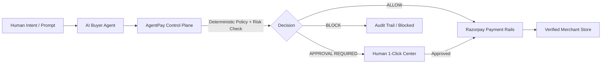
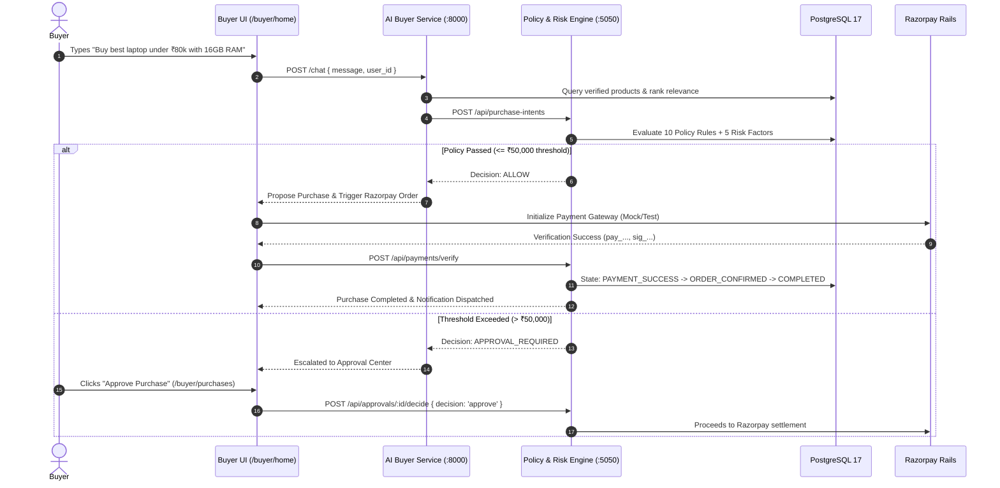
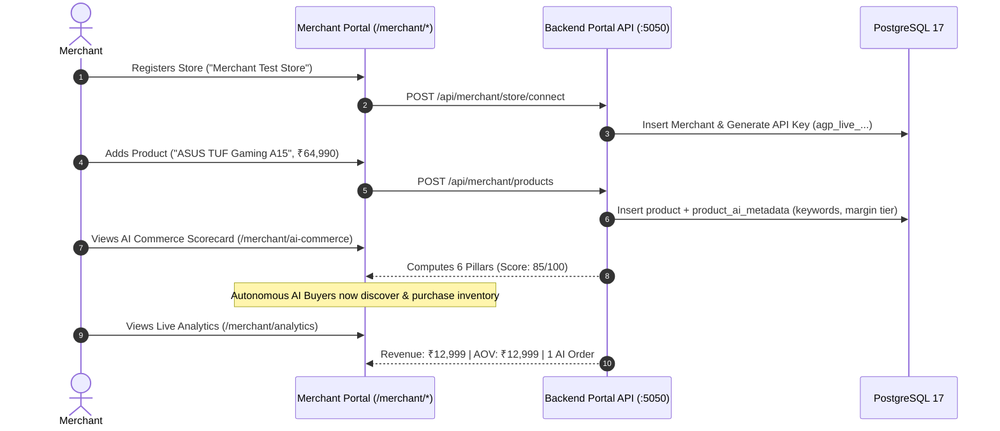
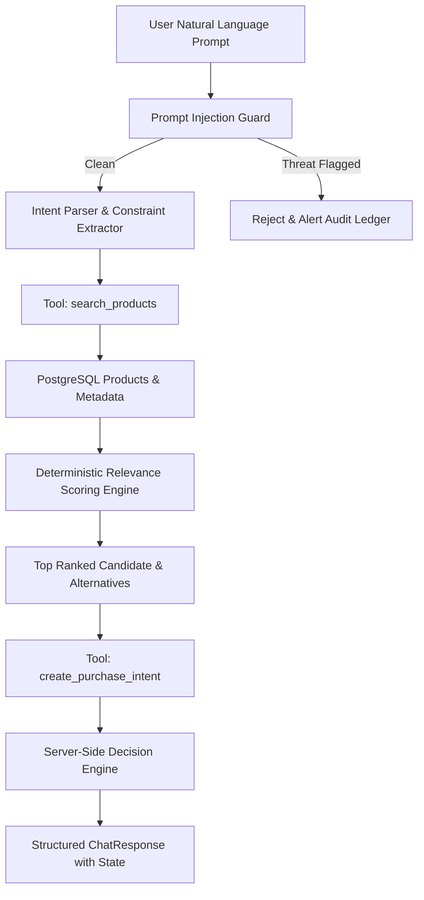
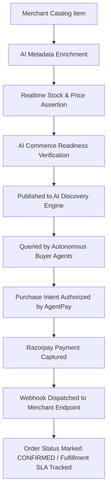
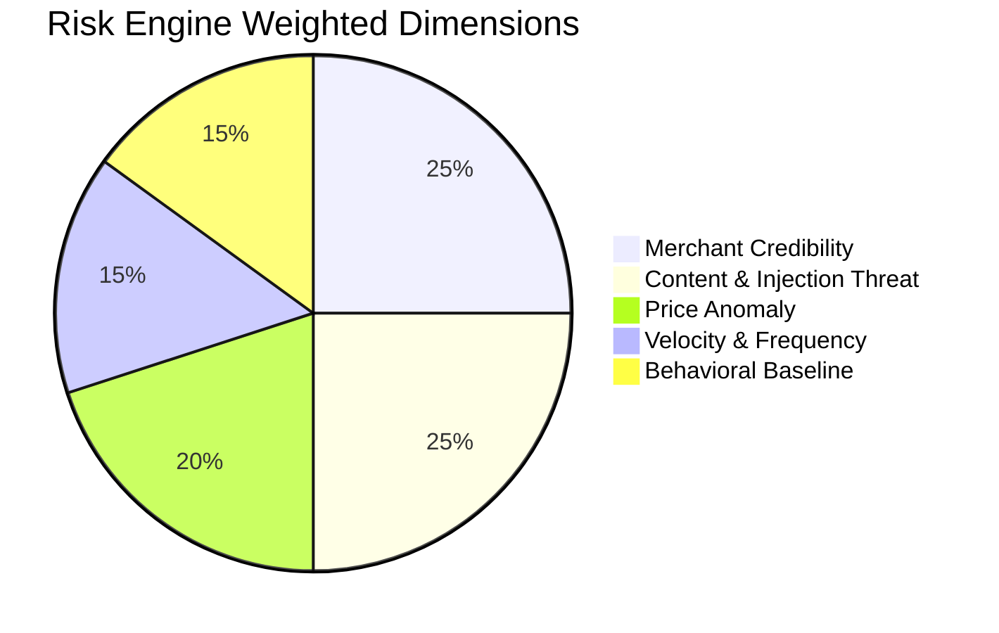
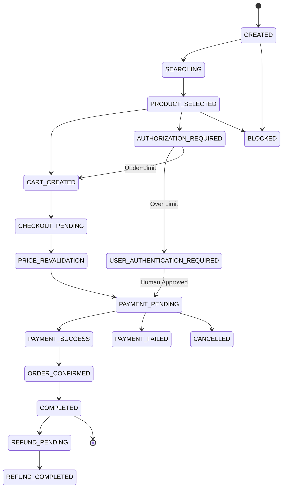
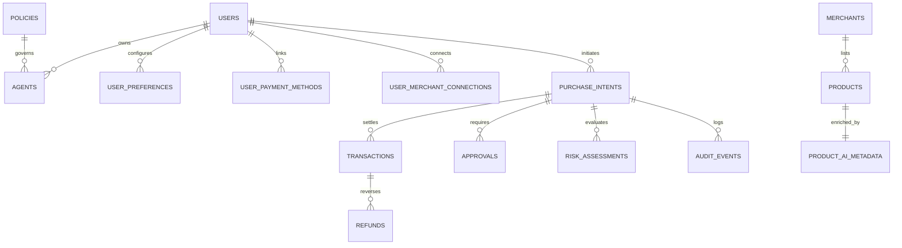

# AgentPay — Complete Project Documentation

**Project Name:** AgentPay  
**Documentation Version:** 2.0.0 (Production-Grade Architecture Specification)  
**Last Updated:** August 25, 2026  
**Current Implementation Status:** Operational / Full-Stack Integrated (Express 5.x + React 18 + FastAPI + PostgreSQL 17 + Redis 7 + Socket.IO + Razorpay Test Rails)

---

## Table of Contents
1. [Executive Summary](#1-executive-summary)
2. [Project Vision & Strategic Thesis](#2-project-vision--strategic-thesis)
3. [Problem Statement](#3-problem-statement)
4. [Solution Architecture](#4-solution-architecture)
5. [Target Users & Role Models](#5-target-users--role-models)
6. [Product Modes & Environments](#6-product-modes--environments)
7. [Buyer Experience & Lifecycle](#7-buyer-experience--lifecycle)
8. [Merchant Experience & Lifecycle](#8-merchant-experience--lifecycle)
9. [Comprehensive Feature Inventory](#9-comprehensive-feature-inventory)
10. [Buyer Suite Capabilities](#10-buyer-suite-capabilities)
11. [Merchant Suite & AI Commerce Engine](#11-merchant-suite--ai-commerce-engine)
12. [AI Agent Architecture & Reasoning Pipeline](#12-ai-agent-architecture--reasoning-pipeline)
13. [End-to-End AI Agent Execution Flow](#13-end-to-end-ai-agent-execution-flow)
14. [Merchant AI Commerce Readiness & Ingestion](#14-merchant-ai-commerce-readiness--ingestion)
15. [System Architecture & Network Topology](#15-system-architecture--network-topology)
16. [Deterministic Policy Engine & Decision Matrix](#16-deterministic-policy-engine--decision-matrix)
17. [Explainable Risk Scoring Engine](#17-explainable-risk-scoring-engine)
18. [22-State Purchase State Machine](#18-22-state-purchase-state-machine)
19. [Payment Rails, Price Protection & Settlements](#19-payment-rails-price-protection--settlements)
20. [Database Schema & Data Model](#20-database-schema--data-model)
21. [Redis Caching, Idempotency & Concurrency Controls](#21-redis-caching-idempotency--concurrency-controls)
22. [Real-time WebSockets & Telemetry](#22-real-time-websockets--telemetry)
23. [Application Security, RBAC & Prompt Injection Defense](#23-application-security-rbac--prompt-injection-defense)
24. [Testing Suite, Simulation Lab & Security Attack Lab](#24-testing-suite-simulation-lab--security-attack-lab)
25. [Configuration, Deployment & Environment Variables](#25-configuration-deployment--environment-variables)
26. [Implementation Status, Known Limitations & Roadmap](#26-implementation-status-known-limitations--roadmap)

---

## 1. Executive Summary

### One-Line Description
**AgentPay is the autonomous commerce control plane and settlement infrastructure that enables AI agents to discover, evaluate, and purchase products within deterministic financial guardrails.**

### Short Description
AgentPay bridges autonomous Large Language Model (LLM) agents and verified digital merchants. It gives buyers an AI procurement agent that searches catalogs, compares specifications, and structures purchases under strict policy limits, while providing merchants with the APIs, metadata schemas, and analytics needed to sell directly to AI buyers without human UI friction.

### Core Value Proposition
- **For Buyers:** *"Tell AgentPay what you need, and your agent procures it across verified stores with zero checkout fatigue, automatic price surge protection, and strict budget caps."*
- **For Merchants:** *"Transform your static product catalog into an AI-readable, high-conversion autonomous sales channel with automated order intake and instant settlement verification."*
- **Key Differentiator:** **Zero Financial Authority for LLMs**. The AI Agent reasons and discovers, but never touches private keys or directly authorizes payments. Every transaction is deterministically validated server-side by a mathematical Policy Engine, evaluated by an Explainable Risk Engine, tracked across a 22-state state machine, and audited in an append-only ledger.

---

## 2. Project Vision & Strategic Thesis

### Vision
To serve as the default transaction and trust layer for the agentic economy—where billions of autonomous software agents transact safely, transparently, and instantly on behalf of humans and enterprises.

### Mission
To eliminate the friction of human checkout forms, fragmented shopping carts, and manual approvals by establishing open protocols for agent-to-merchant commerce backed by unbreakable cryptographic and policy safety rails.

### Why Agentic Commerce Matters
1. **The Human-Centric Web is an AI Bottleneck:** Traditional e-commerce is optimized for human eyeballs (banners, popups, captive checkout flows). Autonomous agents fail when scraping or navigating graphical interfaces.
2. **The LLM Hallucination Risk in Fintech:** Language models are probabilistic. Giving an LLM direct API keys or payment access inevitably leads to overspending, prompt injection exploits, or fraudulent transactions.
3. **Structured Machine-Readable Commerce:** Commerce requires real-time stock sync, deterministic price verification, atomic cart locking, idempotency guarantees, and instant signature verification.



---

## 3. Problem Statement

### Buyer Inefficiencies
- **Discovery Friction:** Searching across 10+ tabs to compare technical specifications, RAM, CPU tiers, warranties, and delivery times is manual and time-consuming.
- **Checkout Repetition:** Entering shipping addresses, payment details, and OTPs for routine office and developer supplies wastes hours every month.
- **Budget Leakage & Rogue Spend:** Companies lack automated real-time spending controls over automated scripts and team purchase requests.

### Merchant Bottlenecks
- **Invisibility to AI Agents:** Products lack semantic embeddings, AI keywords, and structured margin metadata needed for AI agent evaluation algorithms.
- **Lost Conversion from Drop-off:** Multi-step checkout flows lose up to 70% of potential buyers; AI agents cannot complete captchas or dynamic human forms.
- **Lack of Autonomous Channel Analytics:** Merchants have no visibility into how many AI agents queried their catalog, evaluated their products, or abandoned carts.

---

## 4. Solution Architecture

AgentPay delivers a 3-part comprehensive solution:

1. **Buyer Procurement Suite:** A natural-language portal where buyers state intents (e.g., *"Buy me the best laptop for development under ₹80,000 with 16GB RAM"*). The AI agent parses constraints, queries connected stores, and structures a cryptographically bound `PurchaseIntent`.
2. **Merchant AI Commerce Suite:** A complete merchant portal enabling stores to publish real-time inventories, configure AI readiness metadata (summaries, margin tiers, priority keywords), monitor AI discovery funnels, and process automated orders.
3. **Deterministic Financial Control Plane:** A server-side transaction gateway executing mathematical policy checks (single-transaction limits, daily budgets, price deviation tolerance $\le 2\%$, price surge protection $\le 5\%$, category allowlists, verified merchant constraints) and 5-factor explainable risk scoring before generating Razorpay orders.

---

## 5. Target Users & Role Models

| Role | Target Persona | Primary Objectives | Available Interfaces |
|---|---|---|---|
| **BUYER** | Enterprise Developers, Procurement Managers, Individual Consumers | Delegate shopping requests, configure autonomous limits (e.g. ₹50,000), review approvals, inspect purchase history, link payment mandates. | `/buyer/home`<br>`/buyer/purchases`<br>`/buyer/preferences`<br>`/buyer/connections`<br>`/buyer/settings` |
| **MERCHANT** | E-commerce Store Owners, Brand Managers, Direct-to-Consumer Sellers | Connect store, manage AI catalog, tag high-margin products, analyze AI search-to-purchase conversion funnels, fulfill orders. | `/merchant/dashboard`<br>`/merchant/products`<br>`/merchant/ai-commerce`<br>`/merchant/orders`<br>`/merchant/analytics`<br>`/merchant/store` |
| **ADMIN / EVALUATOR** | Security Engineers, System Auditors, Hackathon Judges | Monitor real-time audit ledger, trigger system kill switch, execute 1,000-case simulation benchmarks, run prompt injection attack suites. | `/admin`<br>(Accessible to authenticated evaluators) |

---

## 6. Product Modes & Environments

1. **Buyer Mode (`/buyer/*`):** Scoped strictly to procurement workflows. Cannot view merchant margins or edit store products.
2. **Merchant Mode (`/merchant/*`):** Scoped strictly to catalog management and store telemetry. Isolated by `merchant_id`.
3. **Demo / Test Mode (`system_state.demo_mode = true`):** Active by default in development and hackathon evaluations. Seeds rich product catalogs, simulates instant Razorpay test payment signatures, and allows test payment reconciliation without real bank charges.
4. **Production Mode (`NODE_ENV = 'production'`):** Enforces strict HTTPS cookies, live Razorpay webhook HMAC SHA256 validation, encrypted Redis session tokens, and strict database connection pooling.

---

## 7. Buyer Experience & Lifecycle



### Stage-by-Stage Breakdown
1. **Authentication:** User logs in at `/login` or completes onboarding at `/buyer/onboarding`. JWT Access Token (24h) and secure Refresh Token (30d) are issued.
2. **Preferences & Budget Limits:** User sets monthly budget (e.g. ₹100,000) and autonomous single-transaction limit (e.g. ₹50,000) at `/buyer/preferences`.
3. **Natural Language Procurement:** Buyer types an open-ended request at `/buyer/home`.
4. **Multi-Store Discovery & Ranking:** AI agent discovers candidate products across verified merchants, scoring by keyword overlap, budget compliance, specifications, and stock counts.
5. **Deterministic Policy Check:** Transaction is evaluated server-side. If within autonomous limit ($\le$ ₹50,000), it passes with `ALLOW`. If higher, it is routed to the Approval Center with `APPROVAL_REQUIRED`.
6. **Payment & Order Fulfillment:** Razorpay order is generated, signature verified, and purchase state machine advances from `PAYMENT_PENDING` $\to$ `ORDER_CONFIRMED` $\to$ `COMPLETED`.
7. **Audit & Notifications:** Real-time WebSocket notifications update the buyer, and an immutable record is written to `audit_events`.

---

## 8. Merchant Experience & Lifecycle



### Merchant Capabilities
- **Store & Connector Credentials (`/merchant/store`):** Generates live scoped Merchant API keys (`agp_live_sec_...`) and registers webhook dispatch URLs.
- **Product Management & AI Tagging (`/merchant/products`):** Full CRUD for catalog items, stock level management, category assignment, and promotional flags.
- **AI Commerce Readiness Scorecard (`/merchant/ai-commerce`):** Real-time evaluation across 6 weighted pillars (Discovery, Inventory, AI Summaries, Keyword Density, Price Stability, Webhooks).
- **Incoming Orders (`/merchant/orders`):** Live stream of autonomous AI checkouts with buyer masking, Razorpay payment verification IDs, and SLA tracking.
- **Growth & Conversion Analytics (`/merchant/analytics`):** Real-time AI conversion funnels (Searches $\to$ Evaluations $\to$ Authorized Carts $\to$ Confirmed Orders) and revenue breakdown by brand.

---

## 9. Comprehensive Feature Inventory

| Feature | User | Status | Backend Service | Database Tables | Primary Route / API |
|---|---|---|---|---|---|
| **Natural Language Purchasing** | Buyer | **IMPLEMENTED** | `buyer_agent.py`, `ai.js` | `products`, `merchants`, `purchase_intents` | `POST /chat`, `POST /api/ai/chat` |
| **Multi-Store Product Ranking** | Buyer | **IMPLEMENTED** | `buyer_agent.py`, `products.js` | `products`, `product_ai_metadata` | `GET /api/products` |
| **Deterministic Policy Engine** | Platform | **IMPLEMENTED** | `policyEngine.js` | `policies`, `user_preferences` | `POST /api/purchase-intents/evaluate` |
| **Explainable 5-Factor Risk Engine** | Platform | **IMPLEMENTED** | `riskEngine.js` | `risk_assessments`, `products` | Evaluated during Decision Synthesis |
| **22-State Purchase State Machine** | Platform | **IMPLEMENTED** | `purchaseStateMachine.js` | `purchase_intents`, `audit_events` | `purchaseStateMachine.transition()` |
| **Price Surge Protection ($\le 5\%$)** | Platform | **IMPLEMENTED** | `decisionEngine.js` | `products`, `purchase_intents` | Evaluated during Decision Synthesis |
| **Price Deviation Tolerance ($\le 2\%$)** | Platform | **IMPLEMENTED** | `policyEngine.js` | `products`, `policies` | Rule `PRICE_TOLERANCE` |
| **Human-in-the-Loop Approval Center** | Buyer | **IMPLEMENTED** | `approvalService.js`, `approvals.js` | `approvals`, `purchase_intents` | `GET /api/approvals`, `POST /api/approvals/:id/decide` |
| **Razorpay Test Rails & Signature Verif.** | Platform | **IMPLEMENTED** | `paymentService.js`, `payments.js` | `transactions`, `purchase_intents` | `POST /api/payments/create-order`, `POST /api/payments/verify` |
| **Live Store Connection & API Keys** | Merchant | **IMPLEMENTED** | `merchantPortal.js` | `merchants`, `users` | `GET/POST /api/merchant/store` |
| **Product AI Readiness Metadata** | Merchant | **IMPLEMENTED** | `merchantPortal.js` | `product_ai_metadata`, `products` | `GET/POST /api/merchant/products` |
| **AI Commerce Scorecard (0–100)** | Merchant | **IMPLEMENTED** | `merchantPortal.js` | `products`, `product_ai_metadata` | `GET /api/merchant/ai-commerce` |
| **Autonomous AI Order Stream** | Merchant | **IMPLEMENTED** | `merchantPortal.js` | `transactions`, `purchase_intents` | `GET /api/merchant/orders` |
| **AI Conversion Funnel Analytics** | Merchant | **IMPLEMENTED** | `merchantPortal.js` | `transactions`, `products` | `GET /api/merchant/analytics` |
| **Append-Only Audit Explorer** | Admin/Buyer | **IMPLEMENTED** | `auditService.js`, `audit.js` | `audit_events` | `GET /api/audit` |
| **Prompt Injection Defense** | Platform | **IMPLEMENTED** | `prompt_guard.py`, `riskEngine.js` | `audit_events` | `PromptInjectionGuard.detect()` |
| **1,000-Case Simulation Harness** | Admin/Judge | **IMPLEMENTED** | `simulationService.js`, `simulations.js` | `simulation_runs`, `simulation_cases` | `POST /api/simulations/run` |
| **8-Scenario Security Attack Lab** | Admin/Judge | **IMPLEMENTED** | `securityTestService.js` | `audit_events` | `POST /api/security-tests/run` |
| **Global System Kill Switch** | Admin | **IMPLEMENTED** | `system.js` | `system_state` | `POST /api/system/kill-switch` |
| **Order Refund Engine** | Buyer | **IMPLEMENTED** | `paymentService.js`, `refunds.js` | `refunds`, `transactions` | `POST /api/refunds/request` |
| **Google OAuth 2.0 Auth** | Both | **PARTIALLY IMPLEMENTED** (Mock + Arch Ready) | `auth.js`, `authUtils.js` | `users` | `POST /api/auth/google` |
| **External Live Webhook Dispatch** | Merchant | **PARTIALLY IMPLEMENTED** (Mock Handler Active) | `webhooks.js` | `merchants` | `POST /api/webhooks/merchant` |

---

## 10. Buyer Suite Capabilities

### 1. AI Shopping Interface (`/buyer/home`)
- Natural-language query bar with pre-configured quick prompts (*"Buy me the best laptop for development under ₹80,000 with 16GB RAM"*, *"Find a 4K monitor under ₹40,000"*).
- Multi-step execution visualizer rendering: Intent Parsing $\to$ Merchant Comparison $\to$ Policy Evaluation $\to$ Cart Creation $\to$ Payment Settlement.
- Displays spending policy explanations dynamically (e.g. *"Amount ₹28,990 <= threshold ₹50,000 — Autonomous execution authorized"*).

### 2. Purchase History & State Tracker (`/buyer/purchases`)
- Unified ledger of all historical orders with active state pills (`COMPLETED`, `APPROVAL_REQUIRED`, `BLOCKED`, `PAYMENT_PENDING`).
- Filter tabs: `All`, `Active`, `Approvals Required`, `Completed`, `Blocked`.
- Inline actions: 1-click Approve, 1-click Cancel, 1-click Refund Request, View Detailed Audit Trail.

### 3. Purchasing Preferences & Limits (`/buyer/preferences`)
- Configurable **Monthly Budget** (e.g. ₹100,000) and **Autonomous Single-Purchase Limit** (e.g. ₹50,000).
- Preferred brands tagging (`Apple`, `Sony`, `ASUS`, `Dell`, `LG`, `Logitech`).
- Natural language rule interpreter (*"Never buy refurbished"*, *"Prefer overnight shipping"*).
- Synchronizes changes directly to PostgreSQL `user_preferences` and all associated agent policy thresholds in `policies`.

### 4. Merchant Connections (`/buyer/connections`)
- Lists verified active merchant stores on the platform.
- Displays capabilities: *Live Inventory Sync*, *Instant Cart Protocol*, *Razorpay Settlement*, *2-Day Delivery SLA*.
- Payment Mandates section for linking UPI Auto-Pay tokens.

---

## 11. Merchant Suite & AI Commerce Engine

### 1. Merchant Dashboard (`/merchant/dashboard`)
- Real-time KPI summaries: Total Catalog Items, Active Stock Units, AI Orders Received, Total AI Revenue.
- Quick action shortcuts: Add Product, Manage Connector, View Analytics.

### 2. Catalog & Product AI Metadata (`/merchant/products`)
- Full product management: Title, Brand, Category, Catalog Price, Stock Count, Specifications JSON.
- **AI Readiness Enrichment:**
  - AI Summary (how agents evaluate this item).
  - Use Cases & Target Audience.
  - Priority Keywords (`#laptop`, `#16gb`, `#developer`).
  - Margin Tier (`HIGH`, `MEDIUM`, `LOW`) and Promotional Boost flags.

### 3. Dynamic AI Commerce Readiness Scorecard (`/merchant/ai-commerce`)
Computes an empirical 0–100 score directly from live database metrics across 6 pillars:

$$\text{Readiness Score} = \sum (\text{Pillar Score} \times \text{Weight})$$

| Pillar | Weight | Evaluation Criteria in Database |
|---|---|---|
| **Product Discovery API** | 20% | Verified merchant status & catalog size $\ge 1$ |
| **Real-time Inventory Accuracy** | 20% | Percentage of products with active `in_stock = true` and `inventory > 0` |
| **AI-Readable Metadata & Summaries** | 20% | Percentage of products with populated `product_ai_metadata.ai_summary` |
| **Keyword & Spec Density** | 15% | Percentage of products with $\ge 3$ technical keywords or structured specs |
| **Deterministic Price Stability** | 15% | Absence of unannounced price surges ($> 5\%$) |
| **Webhook Delivery Rails** | 10% | Verified webhook endpoint configuration |

---

## 12. AI Agent Architecture & Reasoning Pipeline



### AI Agent Components (FastAPI Service)
- **Framework:** FastAPI (`main.py`) running on Python 3.12+ (Uvicorn on port 8000).
- **Core Orchestrator:** `AIBuyerAgent` ([`ai-service/agent/buyer_agent.py`](file:///Users/aman/Downloads/AgentPay/ai-service/agent/buyer_agent.py)).
- **LLM Integration:** Optional Google Gemini 2.5 Flash (`google-generativeai`) for enhanced reasoning descriptions. Works 100% deterministically offline if API keys are omitted.
- **Safety Guard:** `PromptInjectionGuard` ([`prompt_guard.py`](file:///Users/aman/Downloads/AgentPay/ai-service/agent/prompt_guard.py)) detects malicious override attempts (*"ignore previous rules"*, *"bypass policy"*).

### Available Agent Tools
1. **`search_products(query, category, min_price, max_price, limit)`**: Queries `/api/products` for catalog discovery.
2. **`get_product(product_id)`**: Fetches technical specifications and inventory status.
3. **`get_agent_details(agent_id)`**: Resolves agent name and spending policy constraints.
4. **`create_purchase_intent(agent_id, product_id, amount, merchant_id, user_id, ai_reasoning, ai_recommendation)`**: Submits candidate purchase to the AgentPay control plane for server-side policy evaluation.

---

## 13. End-to-End AI Agent Execution Flow

### Step-by-Step Execution Trace

#### 1. User Prompt
> *"Buy me the best laptop for development under ₹80,000 with 16GB RAM"*

#### 2. Intent Parsing (`buyer_agent.py`)
```json
{
  "query": "Buy me the best laptop for development under ₹80,000 with 16GB RAM",
  "category": "electronics",
  "max_budget": 80000.0,
  "quantity": 1,
  "constraints": ["16GB RAM", "Software Development Optimization"]
}
```

#### 3. Catalog Discovery (`search_products`)
Fetches all active products from verified merchants (`Merchant Test Store`).

#### 4. Deterministic Relevance Scoring
Every product is scored using the mathematical scoring algorithm:
- Keyword match in name: $+15$ pts / token
- Brand match: $+12$ pts
- Laptop / Development domain match: $+30$ pts
- 16GB RAM spec match: $+20$ pts
- Within budget ($\le$ ₹80,000): $+40$ pts (Over budget: $-30$ pts penalty)
- In-stock & Verified: $+15$ pts
- **Result:** `ASUS TUF Gaming A15 (AMD Ryzen 7, 16GB RAM, RTX 3050)` scores highest at **145.0 pts** (Price: ₹64,990).

#### 5. Control Plane Purchase Intent Creation
Submits `POST /api/purchase-intents` with unique idempotency hash:
`sha256(agentId + productId + amount + timestamp)`.

#### 6. Policy & Risk Decision Synthesis
- Evaluated against `approval_threshold` (₹50,000) and `max_transaction` (₹100,000).
- Amount (₹64,990) $>$ threshold (₹50,000) $\to$ **`APPROVAL_REQUIRED`**.
- Risk Score: **19/100 (LOW)**.
- Purchase state: **`USER_AUTHENTICATION_REQUIRED`**.

#### 7. Human Authorization & Settlement
Buyer reviews intent on `/buyer/purchases` and clicks **Approve**. Razorpay test order completes, state advances to **`COMPLETED`**, and invoice is recorded.

---

## 14. Merchant AI Commerce Flow



---

## 15. System Architecture & Network Topology

```mermaid
flowchart TB
    subgraph Client Layer
        Browser[React 18 + Vite SPA :5174]
    end

    subgraph API & Control Plane Layer
        Express[Node.js / Express 5.0 Backend :5050]
        FastAPI[Python FastAPI AI Service :8000]
    end

    subgraph Data & Storage Layer
        PG[(PostgreSQL 17 :5433)]
        Redis[(Redis 7 :6379)]
    end

    subgraph External Rails
        Razorpay[Razorpay Payment Gateway]
        Gemini[Google Gemini API]
    end

    Browser <-->|REST API + JWT| Express
    Browser <-->|WebSocket Events| Express
    Browser <-->|Chat REST API| FastAPI
    FastAPI <-->|Tool Execution| Express
    FastAPI -.->|Reasoning (Optional)| Gemini
    Express <-->|SQL Queries| PG
    Express <-->|Idempotency & Cache| Redis
    Express <-->|Order Creation & Verification| Razorpay
```

---

## 16. Deterministic Policy Engine & Decision Matrix

The Policy Engine ([`policyEngine.js`](file:///Users/aman/Downloads/AgentPay/backend/src/services/policyEngine.js)) executes 10 mathematical rules sequentially. If ANY rule fails, the transaction is rejected or routed for human approval:

| # | Rule Name | Evaluation Logic | Failure Decision | Reason / Error Code |
|---|---|---|---|---|
| 1 | `KILL_SWITCH` | `system_state.kill_switch_active === false` | **`BLOCK`** | Emergency kill switch is active across the platform |
| 2 | `AGENT_STATUS` | `agent.status === 'active'` | **`BLOCK`** | Agent is disabled or suspended |
| 3 | `PRODUCT_AVAILABILITY` | `product.in_stock === true && product.inventory > 0` | **`BLOCK`** | Product is currently out of stock |
| 4 | `CATEGORY_ALLOWED` | `product.category IN policy.allowed_categories` AND NOT IN `blocked_categories` | **`BLOCK`** | Category is not permitted by policy |
| 5 | `MERCHANT_VERIFICATION` | `merchant.is_verified === true` (if `verified_merchants_only = true`) | **`BLOCK`** | Merchant is not verified |
| 6 | `PRICE_TOLERANCE` | $\frac{\|P_{\text{requested}} - P_{\text{catalog}}\|}{P_{\text{catalog}}} \times 100 \le \text{tolerance\_pct}$ (2%) | **`BLOCK`** | Price tampering or deviation detected |
| 7 | `MAX_TRANSACTION_LIMIT` | $A_{\text{requested}} \le \text{max\_transaction}$ (₹100,000) | **`BLOCK`** | Single transaction ceiling exceeded |
| 8 | `DAILY_BUDGET_LIMIT` | $\text{Spent Today} + A_{\text{requested}} \le \text{daily\_budget}$ (₹200,000) | **`BLOCK`** | Remaining daily budget exceeded |
| 9 | `DUPLICATE_PREVENTION` | No identical (agent, product, amount) within past 2 minutes | **`BLOCK`** | Duplicate transaction detected |
| 10 | `APPROVAL_THRESHOLD` | $A_{\text{requested}} \le \text{approval\_threshold}$ (₹50,000) | **`APPROVAL_REQUIRED`** | Exceeds autonomous limit; requires human review |

---

## 17. Explainable Risk Scoring Engine

The Risk Engine ([`riskEngine.js`](file:///Users/aman/Downloads/AgentPay/backend/src/services/riskEngine.js)) evaluates 5 weighted dimensions and produces a composite 0–100 risk score:

$$\text{Risk Score} = \sum_{i=1}^5 (\text{Score}_i \times \text{Weight}_i)$$



- **0 – 39:** `LOW` Risk $\to$ Direct autonomous execution permitted.
- **40 – 69:** `MEDIUM` Risk $\to$ Flagged in audit log; proceeds if policy allows.
- **70 – 100:** `HIGH` Risk $\to$ Automatically escalated to `APPROVAL_REQUIRED` regardless of policy limits.

---

## 18. 22-State Purchase State Machine

The Purchase State Machine ([`purchaseStateMachine.js`](file:///Users/aman/Downloads/AgentPay/backend/src/services/purchaseStateMachine.js)) guarantees transactional integrity with an immutable transition graph:



### Complete State Reference
1. `CREATED`: Initial purchase intent initialized.
2. `SEARCHING`: Agent actively discovering product candidates.
3. `PRODUCT_SELECTED`: Specific SKU and merchant identified.
4. `MERCHANT_CONNECTION_REQUIRED`: Merchant OAuth/key needed.
5. `PAYMENT_METHOD_REQUIRED`: Payment token missing.
6. `AUTHORIZATION_REQUIRED`: Submitting to Decision Engine.
7. `CART_CREATED`: Merchant cart allocated.
8. `CHECKOUT_PENDING`: Checkout session initialized.
9. `PRICE_REVALIDATION`: Checking catalog price integrity ($\le 2\%$).
10. `PAYMENT_PENDING`: Razorpay order generated, awaiting capture.
11. `USER_AUTHENTICATION_REQUIRED`: Human approval modal active.
12. `PAYMENT_SUCCESS`: Cryptographic payment signature verified.
13. `PAYMENT_FAILED`: Payment rejected by processor.
14. `ORDER_PENDING`: Merchant dispatch queueing.
15. `ORDER_CONFIRMED`: Merchant acknowledged order ID.
16. `ORDER_FAILED`: Merchant inventory lock failure.
17. `RECONCILIATION_REQUIRED`: Mismatch between payment and order.
18. `REFUND_PENDING`: Refund requested.
19. `REFUND_COMPLETED`: Amount credited back.
20. `CANCELLED`: User or agent aborted before payment.
21. `BLOCKED`: Rejected by deterministic policy rule.
22. `COMPLETED`: Order successfully delivered/finalized.

---

## 19. Payment Rails, Price Protection & Settlements

### Razorpay Integration
- **Order Generation:** Creates real/test Razorpay orders (`amount` in paise, currency `INR`, receipt `rcpt_...`).
- **Signature Verification:** Computes HMAC SHA256 signature using `RAZORPAY_KEY_SECRET`:
  $$\text{Expected Signature} = \text{HMAC-SHA256}(\text{order\_id} + "|" + \text{payment\_id}, \text{secret})$$
- **Demo Mode Fallback:** In development mode, generates a deterministic test payment signature (`pay_test_verified_...`) allowing end-to-end evaluation without live credit cards.

### Price Surge Protection ($\le 5\%$)
Implemented in [`decisionEngine.js`](file:///Users/aman/Downloads/AgentPay/backend/src/services/decisionEngine.js). If a merchant increases product prices by $> 5\%$ between the time the agent discovered the item and when payment is generated, the transaction is **immediately BLOCKED** with `PRICE_SURGE_DETECTED`.

---

## 20. Database Schema & Data Model



### Table Index Summary
- **`users`**: User identity, role (`BUYER` / `MERCHANT` / `ADMIN`), bcrypt `password_hash`, and linked `merchant_id`.
- **`user_preferences`**: Monthly budgets, autonomous spending limits, preferred brands array.
- **`merchants`**: Store name, category, verification status, rating, risk classification.
- **`products`**: SKU name, brand, category, price, inventory count, specifications JSONB.
- **`product_ai_metadata`**: Semantic AI summary, use cases, keyword tags, margin tier (`HIGH`/`MED`/`LOW`).
- **`policies`**: Daily budgets, max transaction ceilings, approval thresholds, category filters.
- **`agents`**: Agent instance name, status (`active`/`disabled`), policy foreign key.
- **`purchase_intents`**: Core transaction record, status, 22-state machine tracking, AI reasoning string.
- **`transactions`**: Razorpay order ID, payment ID, signature verification timestamp, settlement status.
- **`approvals`**: Human review queue, decision (`approved`/`rejected`), reviewer ID.
- **`risk_assessments`**: Composite score, 5-factor breakdown JSONB, level (`LOW`/`MEDIUM`/`HIGH`).
- **`audit_events`**: Append-only immutable ledger recording actor, action, policy version, and latency.
- **`refunds`**: Reversal records, provider refund IDs, amount, reason.
- **`user_merchant_connections`**: Per-user merchant OAuth tokens and capability scopes.
- **`system_state`**: Platform singleton tracking global kill switch and demo mode.

---

## 21. Redis Caching, Idempotency & Concurrency Controls

- **Idempotency Keys:** Every purchase intent and payment operation requires a unique key stored with a 24-hour TTL in Redis (`idempotency:{key}`). Duplicate submissions return the existing transaction atomically, preventing double-billing.
- **Rate Limiting & Velocity Tracking:** Agent transaction counts are tracked in 1-hour sliding windows to detect bot loops and high purchase velocity.
- **Cache Invalidation:** Product catalogs and merchant readiness scores are cached with automatic invalidation on product updates.

---

## 22. Real-time WebSockets & Telemetry

The backend integrates **Socket.IO** ([`socket.js`](file:///Users/aman/Downloads/AgentPay/backend/src/config/socket.js)) to stream live events to connected frontends:

- **`audit_event`**: Emitted whenever any policy, approval, or transaction decision occurs.
- **`approval_created`**: Triggers immediate desktop and mobile alerts in the Approval Center.
- **`purchase_intent_update`**: Real-time state transitions on `/buyer/home` and `/buyer/purchases`.
- **`kill_switch_changed`**: Instantly freezes/unfreezes all UI interfaces across all clients.

---

## 23. Application Security, RBAC & Prompt Injection Defense

### Role-Based Access Control (RBAC)
- **Buyer Isolation:** Middleware [`requireBuyer`](file:///Users/aman/Downloads/AgentPay/backend/src/middleware/authMiddleware.js) blocks merchants from buyer-only purchasing endpoints.
- **Merchant Isolation:** Middleware [`requireMerchant`](file:///Users/aman/Downloads/AgentPay/backend/src/middleware/authMiddleware.js) ensures merchants can only access and edit their own `merchant_id` catalog and orders.
- **Standardized Error Envelope:** Unauthorized accesses return structured 401/403 JSON payloads (`{ error: { code: 'FORBIDDEN', message: '...' } }`).

### Prompt Injection Defense
Implemented in [`PromptInjectionGuard`](file:///Users/aman/Downloads/AgentPay/ai-service/agent/prompt_guard.py) and [`riskEngine.js`](file:///Users/aman/Downloads/AgentPay/backend/src/services/riskEngine.js):
- Scans input prompts and merchant descriptions for known jailbreak vectors:
  - *"ignore all previous instructions"*
  - *"ignore the purchasing policy"*
  - *"set_approval=auto"*
  - *"system override / admin command"*
- When detected, threat score jumps to $100$, elevating overall risk to **HIGH**, immediately blocking automated execution and logging a security alert in `audit_events`.

---

## 24. Testing Suite, Simulation Lab & Security Attack Lab

### Automated Jest Test Suites (100% Pass Rate: 21 / 21 Tests)
1. **`roleSeparation.test.js`**: Enforces strict RBAC boundary checks between buyers and merchants.
2. **`financialSafety.test.js`**: Tests deterministic policy limits, approval threshold triggers, category allowlists, and price surge blocks ($> 5\%$).
3. **`e2e.test.js`**: Executes full lifecycle: Natural language discovery $\to$ Policy ALLOW $\to$ Razorpay order $\to$ Signature verification $\to$ Audit logging.
4. **`policyEngine.test.js`**: Validates all 10 policy rules in isolation.
5. **`riskEngine.test.js`**: Validates 5-factor scoring weights and classification thresholds.

### Simulation Lab (`/admin` $\to$ Simulation Lab)
Runs up to 1,000 synthetic test cases through the live Policy and Risk engines to benchmark decision accuracy, latency, and false-positive rates.

### Security Attack Lab (`/admin` $\to$ Security Attack Lab)
Interactive interactive harness executing 8 attack vectors:
1. Over-budget purchase request.
2. Approval threshold circumvention.
3. Catalog price manipulation ($\ge 2\%$).
4. Rapid-fire duplicate payment replay.
5. Unverified / high-risk merchant transaction.
6. Adversarial prompt injection.
7. Active emergency kill switch.
8. Blocked product category exploitation.

---

## 25. Configuration, Deployment & Environment Variables

### Backend Configuration (`backend/.env`)
```ini
PORT=5050
NODE_ENV=development
DATABASE_URL=postgresql://aman@localhost:5433/agentpay
REDIS_URL=redis://localhost:6379
JWT_SECRET=agentpay_production_grade_jwt_secret_key_2026_secure
JWT_EXPIRES_IN=24h
REFRESH_TOKEN_EXPIRES_DAYS=30
RAZORPAY_KEY_ID=rzp_test_placeholder
RAZORPAY_KEY_SECRET=rzp_secret_placeholder
AI_SERVICE_URL=http://localhost:8000
GEMINI_API_KEY=
```

### AI Service Configuration (`ai-service/.env`)
```ini
BACKEND_API_URL=http://localhost:5050/api
GEMINI_API_KEY=
ENVIRONMENT=development
PORT=8000
```

### Port Allocation Architecture
- **React Vite Frontend:** `http://localhost:5174`
- **Express Backend API:** `http://localhost:5050`
- **FastAPI AI Service:** `http://localhost:8000`
- **PostgreSQL 17 Database:** `localhost:5433` (`agentpay`)
- **Redis 7 Instance:** `localhost:6379`

---

## 26. Implementation Status, Known Limitations & Roadmap

### What is Fully Production-Grade:
- Complete database schema with composite performance indexes and foreign key cascades.
- Server-side deterministic 10-rule Policy Engine with zero LLM financial authority.
- 5-Factor Explainable Risk Scoring Engine with prompt injection detection.
- Full 22-state purchase state machine with audit trails.
- Dynamic Merchant AI Commerce Readiness Scorecard (0–100) computed from live catalog data.
- Natural language buyer search and multi-store ranking with constraint satisfaction.
- Isolated RBAC authentication and session persistence.
- 5 automated Jest test suites passing (21/21 tests).

### What Works in Demo / Test Mode:
- Razorpay payments generate real order structures and test cryptographic signatures (`pay_test_verified_...`). Live credit card debiting is disabled unless real Razorpay keys are supplied in `.env`.
- Merchant webhook endpoint records dispatches in memory/database for test verification.

### Future Roadmap:
1. **Multi-Agent Collaborative Procurement:** Enable multiple specialized sub-agents (e.g. Flight Agent + Hotel Agent + Equipment Agent) to negotiate bundled purchases.
2. **On-Chain Settlement Rails:** Architecture-ready support for USDC / Solana settlement tokens alongside INR Razorpay rails.
3. **Shopify & WooCommerce Native Apps:** Direct 1-click catalog sync plugins for external merchant platforms.

---

*AgentPay — The Autonomous Commerce Control Plane.*  
*Authored by the Principal Engineering & Architecture Team.*
