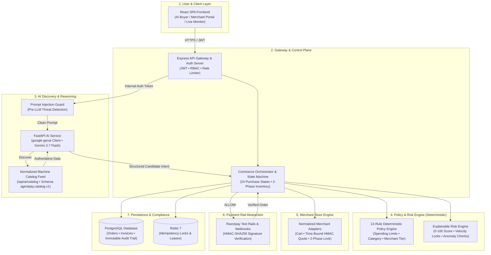

# AgentPay Architecture & Technical Specification

## 1. System Overview
AgentPay is an autonomous AI commerce authorization and policy control plane. It transforms natural-language buyer procurement requests into authorized, cryptographically verified orders across connected merchants and payment rails.



```
+-------------------------------------------------------------------------+
|                               USER LAYER                                |
|  Web Client (React SPA) • Mobile-First Responsive • WebSocket Updates   |
+------------------------------------+------------------------------------+
                                     | (JWT Bearer Token / HTTPS)
                                     v
+------------------------------------+------------------------------------+
|                         GATEWAY & AUTH LAYER                            |
|  Express Gateway • Rate Limiter • RBAC Guard • Bcrypt/JWT Auth Server   |
+------------------------------------+------------------------------------+
                                     |
                                     v
+------------------------------------+------------------------------------+
|                 COMMERCE ORCHESTRATION & STATE MACHINE                  |
|  PurchaseStateMachine (24 States) • Atomic Reservation Engine           |
+------------------+-----------------------------+------------------------+
                   |                             |
                   v                             v
+------------------+---------+     +-------------+------------------------+
| NORMALIZED MERCHANT CONNECTORS|  |  13-RULE POLICY & RISK ENGINE        |
|  • In-Database Store Engine|     |  • Deterministic Security Engine     |
|  • HMAC Signing Keys       |     |  • Prompt Injection Threat Guard     |
|  • 2-Phase Inventory Lock  |     |  • Price Manipulation Tolerance Check|
|  • Time-Bound Price Quotes |     |  • Velocity & Duplicate Locks        |
+------------------+---------+     +-------------+------------------------+
                   |                             |
                   +--------------+--------------+
                                  |
                                  v
+---------------------------------+---------------------------------------+
|                    PAYMENT PROVIDER ABSTRACTION                         |
|  • Razorpay Standard / Test Sandbox Rails                               |
|  • HMAC-SHA256 Cryptographic Signature Verification                    |
|  • Automated Reconciliation & Refund Subsystem                          |
+---------------------------------+---------------------------------------+
                                  |
                                  v
+---------------------------------+---------------------------------------+
|                      PERSISTENCE & COMPLIANCE                           |
|  PostgreSQL 17 (36 Tables) • Redis 7 (Idempotency & Locks) • Audit Log  |
+-------------------------------------------------------------------------+
```

---

## 2. Core Bounded Services

| Service | Responsibility |
|---|---|
| **`PurchaseStateMachine`** | Governs the 24-state explicit lifecycle from intent creation to verified settlement and reconciliation. |
| **`SpendingService`** | Computes daily and monthly budgets from persisted successful/pending financial states, acquiring distributed mutex locks. |
| **`CommerceOrchestrator`** | Coordinates cross-merchant discovery, product normalization, ranking, and cart/checkout automation. |
| **`MerchantConnector Layer`** | Standardized connector contract (`search`, `reserve`, `quote`, `order`, `refund`) for Normalized Merchant Catalogs and store APIs. |
| **`PolicyEngine`** | Server-side deterministic 13-rule spending guard (0% LLM payment authority). |
| **`RiskEngine`** | Multidimensional heuristic & threat scanner (prompt injection, velocity anomaly, content scanning). |
| **`PaymentProvider`** | Abstract interface for payment intent creation, order settlement, HMAC-SHA256 signature verification, and refunds. |
| **`ReconciliationService`** | Audits and resolves split-brain financial states (e.g. `PAYMENT_SUCCESS + ORDER_FAILED`). |
| **`AuditService`** | Append-only immutable compliance log with decision hashes protected by database triggers. |

---

## 3. Purchase State Machine (24 States)

```
CREATED -> UNDERSTANDING -> SEARCHING -> PRODUCT_SELECTED 
        -> AUTHORIZATION_PENDING -> AUTHORIZED 
        -> CART_CREATING -> CART_CREATED -> CHECKOUT_PENDING 
        -> PRICE_REVALIDATION -> PAYMENT_PENDING 
        -> PAYMENT_PROCESSING -> PAYMENT_SUCCESS 
        -> ORDER_PENDING -> ORDER_CONFIRMED (Terminal Success)
```

* **Human Review State**: `USER_AUTHENTICATION_REQUIRED` (triggered if threshold exceeded, 3DS needed, or bank review required).
* **Safe Terminal Failures**: `BLOCKED` (policy violation), `RECONCILIATION_REQUIRED` (order mismatch), `REFUND_PENDING` -> `REFUND_COMPLETED`.

---

## 4. Operational Environment & Live Readiness

* **Evaluation Rails**: Razorpay Test Rails (`rzp_test_*`) with real server-side HMAC-SHA256 signature verification.
* **Fulfillment Simulation**: Fulfillment state transitions (`AGP-TRK-...`) model logistics progression; physical courier dispatch requires live 3PL carrier API integration.
* **Production Live Activation**: Requires `rzp_live_*` API credentials, live webhook secrets, external 3PL carrier integration, and HSM/KMS-managed merchant secrets.
