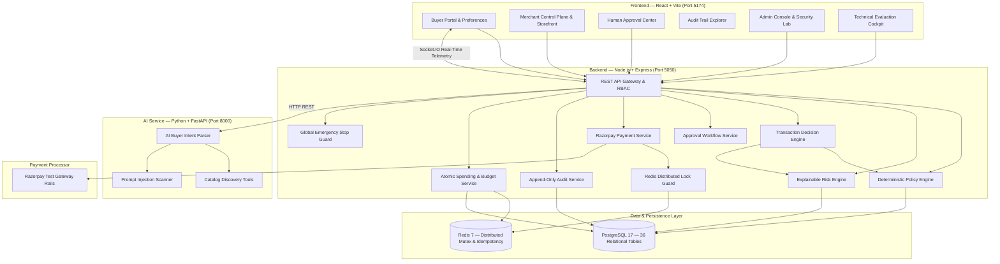

# AgentPay — Autonomous AI Commerce Authorization & Control Plane

[]()
[]()
[]()
[](./AGENTPAY_ARCHITECTURE.md)

> **"AI decides what to buy. AgentPay decides whether the AI is allowed to spend."**

AgentPay is a deterministic authorization, policy enforcement, explainable risk assessment, and payment execution control plane built specifically for autonomous AI buyer agents.

📖 **[Read the Canonical Architecture Specification (AGENTPAY_ARCHITECTURE.md)](./AGENTPAY_ARCHITECTURE.md)** for detailed technical invariants, database schemas, and architectural defense specifications.

---

## 1. Executive Summary & Problem Thesis

As autonomous AI agents evolve into independent procurement systems capable of sourcing equipment, cloud infrastructure, and software subscriptions, the fundamental vulnerability is **unbounded financial authority**.

Granting Large Language Models (LLMs) direct payment credentials or autonomous checkout authority introduces critical failure modes:
* **Probabilistic Arithmetic**: LLMs cannot provide mathematical guarantees on budget ceilings or cumulative spending.
* **Prompt Injection & Catalog Poisoning**: Adversarial text embedded in merchant descriptions can hijack model instructions to exfiltrate funds or alter order amounts.
* **Price Tampering**: Unverified checkout payloads can inflate prices after intent creation.
* **Concurrency & Double Charges**: Unsynchronized agent retry loops can cause race-condition double spending.

### The Core Architectural Invariant

```
LLM (AI Buyer Agent)
  ↓ [Natural Language Request]
Product Discovery & Comparison
  ↓ [Structured Purchase Intent (Zero Financial Authority)]
Server-Side Request Validation
  ↓
Deterministic Policy Engine (13 Rules)
  ↓
Explainable Risk Engine (0–100 Scoring, 5 Pillars)
  ↓
Transaction Decision Engine [ALLOW / APPROVAL_REQUIRED / BLOCK]
  ↓
Human-in-the-Loop Approval Center (When Thresholds Exceeded)
  ↓
Distributed Idempotency & Budget Lock (Redis Mutex)
  ↓
Razorpay Payment Service (Test Rails with HMAC-SHA256 Verification)
  ↓
Immutable Append-Only Audit Trail (PostgreSQL Trigger Protected)
```

**The AI model is strictly a reasoning and discovery assistant. All financial authorization, risk scoring, idempotency enforcement, and payment settlement occur deterministically server-side.**

---

## 2. Architectural Scope & Environment Disclosure

To ensure technical truthfulness under engineering review, AgentPay clearly distinguishes between the target production design, the current evaluation implementation, and the internal simulation/security tooling:

| Dimension | Target Production Architecture | Current Evaluation Implementation |
|---|---|---|
| **Payment Gateway** | Razorpay Live Rails (`rzp_live_*`) with live webhooks | **Razorpay Test Rails (`rzp_test_*`)** with live HMAC-SHA256 signature verification |
| **Merchant Integration** | Multi-tenant ERP/Store connectors & external webhooks | **Normalized In-Database Merchant Connector** (verified catalog, rotatable HMAC secrets) |
| **Fulfillment & Logistics** | Physical 3PL carrier APIs (e.g. Shiprocket, Delhivery) | **Simulated Fulfillment Lifecycle** (deterministic state machine with generated tracking tokens) |
| **AI Intent Parsing** | Live Google Gemini 1.5 Pro with structured function calling | **Gemini 1.5 Pro** with deterministic rule-based offline fallback |
| **Idempotency & Locks** | Multi-node Redis 7 cluster with SetNX distributed locks | **Redis 7** mutex locking with automatic local in-memory fallback |
| **Audit Trail** | Append-only PostgreSQL with trigger protection & external sync | **PostgreSQL 17** with `trg_prevent_audit_events_mutation` trigger |

---

## 3. System Architecture & Component Dataflow



---

## 4. Normalized Merchant Connector Architecture

Rather than relying on brittle third-party web scrapers or unauthorized marketplace logins, AgentPay implements a **Normalized Merchant Connector Architecture**:

1. **Structured Merchant Registry (`merchants`, `merchant_profiles`)**: Stores merchant business profiles, KYC verification status, verified tier levels, and commission schedules.
2. **Standardized Product Catalog (`products`, `product_ai_metadata`)**: Normalizes product specifications, technical attributes, inventory stock levels, price tiers, and AI search embeddings.
3. **Cryptographic Connector Credentials**: Each merchant is provisioned with a rotatable API Key (`SHA-256` key hash) and a Webhook Secret (`HMAC-SHA256`) for outbound order dispatch.
4. **Two-Phase Inventory Lock**: Row-level reservation (`inventory_reservations`) locks inventory for 15 minutes during checkout to prevent overselling.
5. **Deterministic Price Quotes (`quotes`)**: 15-minute time-bound cryptographic quotes prevent price drift and checkout surge tampering.

---

## 5. Core Modules & Engine Specifications

### 1. Deterministic Policy Engine (13 Rules)
Evaluates every purchase intent server-side prior to financial execution:
1. **Global Emergency Kill Switch Check** (`system_state.kill_switch_active`)
2. **Agent Operational Status Verification** (`active` vs `disabled`/`suspended`)
3. **Product Inventory & In-Stock Availability**
4. **Authorized Category Whitelist Validation** (`allowed_categories`)
5. **Restricted Category Blacklist Enforcement** (`blocked_categories`)
6. **Merchant Authenticity & Verification Tier** (`verified_merchants_only`)
7. **Price Tampering Tolerance Guard** (`price_tolerance_pct` max 2.0%)
8. **Single-Transaction Hard Spending Ceiling** (`max_transaction`)
9. **Daily Spending Limit & Active Intent Reservation** (`daily_budget`)
10. **5-Minute Sliding Window Duplicate Prevention**
11. **Maximum Retry Limit Enforcement**
12. **Autonomous Spending Threshold Gate** (`approval_threshold`)
13. **Deterministic Output Synthesis**: Exactly one of `ALLOW`, `APPROVAL_REQUIRED`, or `BLOCK`.

### 2. Explainable 0–100 Risk Engine
Calculates an explainable numerical risk score with granular factor weights:
* **Merchant Credibility (25% Weight)**: Verified status, historical fulfillment consistency.
* **Content Threat & Injection Detection (25% Weight)**: Adversarial pattern scanner on catalog descriptions.
* **Price Anomaly & Deep Discount Flagging (20% Weight)**: Outlier detection against historical baselines.
* **Transaction Velocity (15% Weight)**: Frequency bursts exceeding normal agent cadence.
* **Agent Behavioral Deviation (15% Weight)**: Deviation from historical mean transaction value.
* **Tiers**: `LOW` (0–39), `MEDIUM` (40–69), `HIGH` (70–100). High risk automatically escalates compliant intents to human review.

### 3. Razorpay Payment Service (Test Rails)
* Creates Razorpay orders server-side only after positive authorization.
* Verifies `razorpay_signature` via HMAC-SHA256 (`crypto.createHmac('sha256', secret)`).
* Enforces distributed Redis idempotency locks (`idempotency_key = hash(intent_id + amount + policy_version)`).
* Transitions in-flight transactions safely to `RECONCILIATION_REQUIRED` if emergency stops trigger during execution.

### 4. Human-in-the-Loop Approval Center
* Intercepts purchases exceeding autonomous limits (e.g. > ₹25,000) or high-risk scores.
* Provides one-click supervisor approval or rejection with transparent AI reasoning and policy diffs.

### 5. Immutable Append-Only Audit Trail
* Protected by PostgreSQL database trigger `trg_prevent_audit_events_mutation` blocking `UPDATE` and `DELETE` operations.
* Records actor, agent, policy version, decision, risk score, and settled transaction ID.

---

## 6. Internal Security & Simulation Tooling

For testing and technical evaluations, AgentPay includes isolated administrative and evaluation interfaces:

* **Security Attack Lab (`/security-lab`)**: Demonstrates live defenses against 7 adversarial scenarios (Over-Budget, Price Tampering, Duplicate Replay, Prompt Injection, Revoked Agent, Threshold Escalation, Kill Switch).
* **Simulation Lab (`/simulation`)**: Benchmark harness evaluating 1,000 synthetic test cases through the live Policy and Risk engines to verify decision consistency.
* **Technical Evaluation Cockpit (`/judge`)**: 15-step auto-pilot sequence demonstrating the full lifecycle on live backend services.

---

## 7. Tech Stack & Environment

| Layer | Technology | Version / Notes |
|---|---|---|
| **Frontend** | React, Vite, Modern Vanilla CSS Design System | React 18, React Router 6, Socket.IO Client |
| **Backend** | Node.js, Express.js, Socket.IO | ES Modules, Joi validation, pg pool |
| **AI Service** | Python, FastAPI, Uvicorn, Pydantic | Python 3.12, Prompt Guard, Gemini 1.5 Pro |
| **Database** | PostgreSQL | **36 Relational Tables**, 15 Migrations (`001`–`014` + `006_strict`) |
| **Cache & Locks** | Redis | Redis 7 mutex locking with local in-memory fallback |
| **Payments** | Razorpay Gateway | **Test Sandbox Rails** (`rzp_test_*`), HMAC-SHA256 verification |
| **Fulfillment** | Order State Machine | Simulated order fulfillment lifecycle with generated tracking tokens |

---

## 8. Installation & Quick Start

### Prerequisites
* Node.js >= 18
* Python >= 3.11
* PostgreSQL 16/17 (Port 5433 or 5432)
* Redis (Port 6379)

### 1. Environment Configuration

#### Backend (`backend/.env`):
```env
PORT=5050
NODE_ENV=development
DATABASE_URL=postgresql://aman@localhost:5433/agentpay
REDIS_URL=redis://localhost:6379
RAZORPAY_KEY_ID=rzp_test_xxxxxxxxxxxxx
RAZORPAY_KEY_SECRET=xxxxxxxxxxxxxxxxxxxxxxxx
AI_SERVICE_URL=http://localhost:8000
GEMINI_API_KEY=your_google_gemini_api_key_here
```

#### Frontend (`frontend/.env`):
```env
VITE_API_URL=http://localhost:5050
VITE_SOCKET_URL=http://localhost:5050
VITE_RAZORPAY_KEY_ID=rzp_test_xxxxxxxxxxxxx
```

#### AI Service (`ai-service/.env`):
```env
AI_SERVICE_PORT=8000
BACKEND_API_URL=http://localhost:5050/api
GEMINI_API_KEY=your_google_gemini_api_key_here
```

### 2. Database Migration & Seeding
```bash
cd backend
npm install
npm run migrate
npm run seed
```

### 3. Start Backend Service (Port 5050)
```bash
npm run dev
```

### 4. Start AI Service (Port 8000)
```bash
cd ../ai-service
python3.12 -m venv .venv
source .venv/bin/activate
pip install -r requirements.txt
python main.py
```

### 5. Start Frontend Application (Port 5174)
```bash
cd ../frontend
npm install
npm run dev
```

Application URL: **`http://localhost:5174`**

---

## 9. Automated Test Battery

AgentPay includes a rigorous automated test battery verifying financial safety, concurrency locks, price integrity, payment verification, and prompt defense:

* **Backend Test Battery**: **50 test suites, 502 automated tests passing**.
* **AI Service Suite**: **4 / 4 pytest tests passing** (`tests/test_prompt_guard.py`).
* **Security Audit Battery**: **8 dedicated security suites (88 / 88 tests passing)**.
* **Clean-Room E2E Validation**: [`tests/cleanRoomE2EValidation.test.js`](./backend/tests/cleanRoomE2EValidation.test.js).

```bash
# Run backend test battery
cd backend
node --experimental-vm-modules ./node_modules/.bin/jest --runInBand --forceExit

# Run AI service pytest suite
cd ../ai-service
source .venv/bin/activate
pytest -v
```

---

## 10. Production Readiness & Live Activation Checklist

To transition AgentPay from the current competition/test rail environment to live production settlement, the following prerequisites are required:

1. **Production Razorpay Gateway Credentials**: Replace `rzp_test_*` API keys and webhook secrets with verified `rzp_live_*` production credentials and configure live webhook endpoints in the Razorpay Merchant Dashboard.
2. **Third-Party Logistics (3PL) Integration**: Connect live shipping aggregator APIs (e.g. Shiprocket, Delhivery, Bluedart) to replace simulated fulfillment lifecycles with physical shipping label generation and real carrier tracking.
3. **Enterprise Key Management (KMS)**: Transition merchant HMAC secrets and database encryption keys to AWS KMS, Google Cloud KMS, or HashiCorp Vault.
4. **External Webhook Security**: Configure IP whitelisting and mutual TLS (mTLS) for inbound Razorpay webhook ingestion.
5. **Distributed Redis Sentinel / Cluster**: Deploy a high-availability Redis cluster for production-grade distributed mutex locking under high concurrency.
6. **Regulatory Compliance & Tax E-Invoicing**: Integrate live GSTN e-invoicing APIs (NIC/IRP) for real-time B2B IRN generation and signed QR codes.

---

## 11. License

MIT License — Built for the Razorpay Buildathon under the **AI Growth & Agentic Commerce** track.
